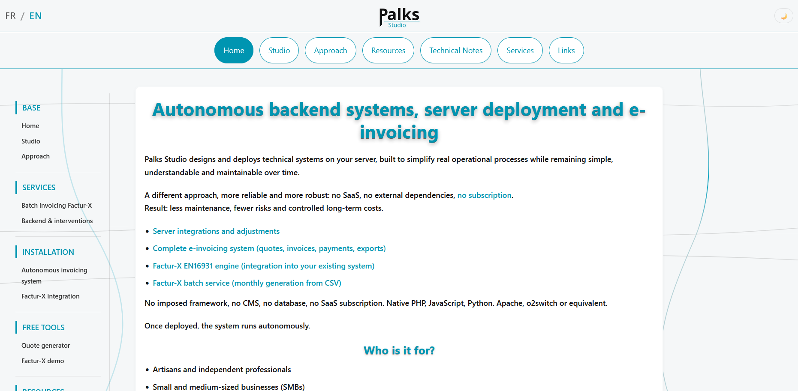

<p align="center">
  
</p>

> 🇬🇧 English | [🇫🇷 Français](./README_FR.md)


<p align="center">
  <a href="https://palks-studio.com">
    
  </a>
</p>

# Palks Studio — Static site + digital storefront  

> This repository is a technical presentation and documentation repository.  
> It does not contain downloadable source code or production files.

This repository contains the public website of Palks Studio, which combines:  

- a clean, tracking-free static HTML website  
- a lightweight server-side digital storefront  
- an autonomous PDF invoicing system  
- and secure token-based delivery of downloadable files  

The system operates without a CMS, without a database, and without unnecessary SaaS dependencies,  
relying solely on flat files (JSON/CSV) and minimalist PHP scripts.  

The repository includes:  

- the public website (pages, styles, images, content)  
- payment and digital delivery components  
- as well as publicly accessible documentation  
with the aim of clarity, readability, and transparency  

This repository is not a turnkey product, a framework, or a software library.  
It serves as a reference artifact to understand the approach,  
tools, and technical choices carried by Palks Studio.  

---

## About Palks Studio  

Palks Studio designs technical tools, documentation structures,  
and working environments intended to be:  

- readable  
- understandable  
- autonomous  
- maintainable over time  

The emphasis is placed on:  

- functional simplicity  
- control of dependencies  
- transparency of technical choices  
- durability rather than trends  

---

## Project structure

```
/palks-studio-website/
│
├── palks-studio.com/
│    │
│    ├── fr/                                 → Pages du site (FR) / Website pages (EN)
│    ├── en/                                 → Pages du site (FR) / Website pages (EN)
│    │
│    ├── facturx-demo/
│    │   ├── invoice-generator.php           → Point d’entrée de génération de facture (FR) / Invoice generation entry point (EN)
│    │   ├── invoice-template.php            → Modèle HTML de facture (FR) / Invoice HTML template (EN)
│    │   ├── facturx-xml-builder.php         → Construction du XML Factur-X (FR) / Factur-X XML builder (EN)
│    │   ├── inject-facturx-xml.py           → Injection du XML dans le PDF (FR) / XML injection into PDF (EN)
│    │   ├── direct-generation-engine.php    → Pipeline de génération directe (FR) / Direct generation pipeline (EN)
│    │   └── vendor/                         → Dépendances packagées (FR) / Packaged dependencies (EN)
│    │
│    ├── api/
│    │   ├── facturx-generation-engine.php   → Orchestrateur de génération Factur-X (FR) / Factur-X generation orchestrator (EN)
│    │   ├── facturx-xml-builder.php         → Construction du XML Factur-X (FR) / Factur-X XML builder (EN)
│    │   ├── inject-facturx-xml.py           → Injection du XML dans le PDF (FR) / XML injection into PDF (EN)
│    │   ├── invoice-template.php            → Modèle HTML de facture (FR) / Invoice HTML template (EN)
│    │   └── vendor/                         → Dépendances packagées (FR) / Packaged dependencies (EN)
│    │
│    ├── assets/
│    │   ├── css/
│    │   │   └── global-style.css            → Global stylesheet (FR) / Feuille de styles globale (EN)
│    │   └── img/                            → Images et visuels (FR) / Images and visuals (EN)
│    │
│    ├── batch-downloads/
│    │   └── batch-download-access.php       → Point d'accès aux téléchargements batch (FR) / Batch download access endpoint (EN)
│    │
│    ├── store/                              → Fichiers produits numériques (FR) / Digital product files (EN)
│    ├── contract-pdf-generator.php          → Backend génération PDF (FR) / PDF generation backend (EN)
│    ├── batch-upload-engine.php             → Moteur de traitement du formulaire CSV (FR) / CSV upload form processing engine (EN)
│    ├── robots.txt                          → Règles pour moteurs de recherche (FR) / Search engine directives (EN)
│    ├── sitemap.xml                         → Plan du site pour indexation (FR) / Sitemap for indexing (EN)
│    ├── manifest.json                       → Configuration PWA du système (FR) / System PWA configuration (EN)
│    │
│    ├── library/
│    │   ├── contract-client-config-fr.html  → Génération contrat + configuration client (FR)
│    │   ├── contract-client-config-en.html  → Contract generation + client configuration (EN)
│    │   ├── contract-template-fr.html       → Template de contrat (FR)
│    │   ├── contract-template-en.html       → Contract template (EN)
│    │   ├── batch-upload-fr.html            → Formulaire d’envoi CSV client (FR)
│    │   ├── batch-upload-en.html            → Client CSV upload form (EN)
│    │   ├── payment-cancel.html             → Page d’annulation de paiement (FR)/ Payment cancellation page (EN)
│    │   ├── payment-success.html            → Page de paiement validé (FR) / Payment success page (EN)
│    │   └── invoice-template.html           → Template HTML de facture (FR) / Invoice HTML template (EN)
│    │
│    └── stripe/
│        ├── checkout-session.php            → Initialisation d’une session de paiement (FR) / Checkout session initialization (EN)
│        ├── payment-webhook.php             → Traitement post-paiement (FR) / Post-payment fulfillment handler (EN)
│        └── secure-download.php             → Point d’accès sécurisé aux fichiers (FR) / Secure file access endpoint (EN)
│
│
└── palks-studio/
     ├── invoice-counter.json               → Compteur persistant de factures (FR) / Persistent invoice counter (EN)
     ├── invoice-counter-reader.php         → Lecture sécurisée du prochain numéro de facture (FR) / Secure invoice counter reader (EN)
     ├── invoice-counter-engine.php         → Incrémentation atomique du numéro de facture (FR) / Atomic invoice number increment (EN)
     ├── invoice-html-engine.php            → Génération HTML des factures (FR) / Invoice HTML generation (EN)
     ├── transactional-mailer.php           → Envoi d’e-mails transactionnels (FR) / Transactional email delivery (EN)
     ├── invoice-pdf-engine.php             → Génération PDF via mPDF (FR) / PDF generation via mPDF (EN)
     ├── system-config.php                  → Configuration centralisée des chemins et variables système (FR) / Centralized system paths and variables configuration (EN)
     ├── rate-limit-storage.json            → Stockage des limitations de requêtes IP (FR) / IP request rate limit storage (EN)
     │
     ├── config/
     │   └── download-config.php            → Configuration centrale des téléchargements (FR) / Central download configuration (EN)
     │
     ├── cron/
     │   └── cleanup-expired-data.php       → Nettoyage automatique des journaux et fichiers expirés (FR) / Automatic cleanup of logs and expired files (EN)
     │
     ├── download-tokens/
     │   ├── download-activity.log          → Journal des téléchargements réels (FR) / Download activity log (EN)
     │   └── download-tokens.json           → Stockage des tokens de téléchargement (FR) / Download token storage (EN)
     │
     ├── pdf/
     │   ├── invoices/                      → Factures PDF générées (FR) / Generated PDF invoices (EN)
     │   └── accounting-records/            → Journaux comptables CSV (FR) / Accounting CSV records (EN)
     │
     ├── logs/                              → Journaux système et erreurs (FR) / System logs and errors (EN)
     ├── phpmailer/                         → Bibliothèque d’envoi email (FR) / Email sending library (EN)
     ├── stripe-php/                        → SDK Stripe PHP officiel (FR) / Official Stripe PHP SDK (EN)
     ├── vendor/                            → Dépendances Composer PHP (FR) / Composer PHP dependencies (EN)
     │
     ├── LICENCE.md                         → Conditions d’utilisation et cadre légal (FR)
     ├── LICENSE.md                         → Terms of use and legal framework (EN)
     │
     └── docs/
         ├── SYSTEM-OVERVIEW_FR.md          → Vue d’ensemble du système (FR)
         ├── SYSTEM-OVERVIEW.md             → System overview (EN)
         ├── PROJECT-OVERVIEW_FR.md         → Vue d’ensemble du projet (FR)
         ├── PROJECT-OVERVIEW.md            → Project overview (EN)
         ├── README_FR.md                   → Présentation générale (FR)
         └── README.md                      → General overview (EN)
```


---

## Architecture Summary

The system follows a deliberately minimal architecture:  

- Static frontend (HTML/CSS)  
- PHP backend endpoints  
- Flat file storage (JSON / CSV)  
- Stripe as payment processor  
- No database layer

Design goals:  

- deterministic behavior  
- traceable operations  
- minimal dependencies  
- long-term maintainability

### Layered architecture — reminder

The system clearly separates:  

- the public web facade (`palks-studio.com`)  
- controlled ingestion points (contract, CSV upload)

The presence of web forms does not imply  
that billing execution occurs on the web layer.


All financial generation is triggered by the Stripe webhook  
and processed server-side.

---

## The Palks Studio website (public version)

The site pages present:  

- the studio and its approach  
- the available resources  
- the conceptual foundations  
- the technical tools developed  
- the technical notes and engineering reflections  
- the legal and informational pages  
- as well as a free bilingual PDF quote generator that runs entirely in the browser.

This tool operates fully client-side (JavaScript + jsPDF) and does not transmit  
any data to a server. It allows users to quickly create professional quotes  
with multiple service lines, automatic subtotal / VAT / total calculations,  
and direct PDF export.

The generator is completely independent from the billing pipeline  
(Stripe → Webhook → Invoice → Token → Download) and does not create  
any transaction or archive on the server side.

### Resources and digital distribution

Some resources are provided as documents, archives, or downloadable files,  
particularly when the content includes:  

- multiple files  
- complete structures  
- examples or educational materials  
- reusable tools or templates  

These elements are grouped in dedicated folders to preserve  
repository clarity and deliverable traceability.

File distribution is handled via a secure system based on temporary,  
single-use links, logged on the server side.

---

### Factur-X Demo

A Factur-X invoice generation demo is available on the site.

This demo is intentionally limited to ensure service stability and prevent abuse.

The demo pipeline includes:  

- HTML invoice template rendering  
- Factur-X XML construction (EN16931 compliant)  
- XML injection into the PDF

For professional use, a complete and compliant integration can be set up according to specific needs.

---

## What this repository is

- A public static site + lightweight digital storefront  
- A technical and documentary showcase  
- A public reference point  
- A support for understanding  
- A demonstration of structure and method  
- A concrete example of a sober architecture without CMS or database  
- as well as a free PDF quote generator, bilingual FR/EN, running entirely in the browser

---

## What this repository is not

- An e-commerce framework  
- A SaaS platform  
- A generic turnkey product  
- A software library  
- A support or contractual update space  

Keys, secrets, and certain production paths are not exposed here.

---

## Design Principles

Palks Studio follows a small set of consistent principles:  

- simplicity over abstraction  
- transparency over automation  
- autonomy over dependency  
- readability over optimization  
- long-term stability over trends

---

## Transparency and approach

Palks Studio chooses to:  

- seriously document its projects  
- explain choices and limits  
- avoid vague promises  
- not hide work behind marketing  
- prioritize readability and traceability over complexity  

The code, structures, and documentation are designed to be understood  
before any decision of use or purchase.

This repository fully participates in this transparency approach.

---

© Palks Studio — see LICENSE.md  
- https://palks-studio.com
