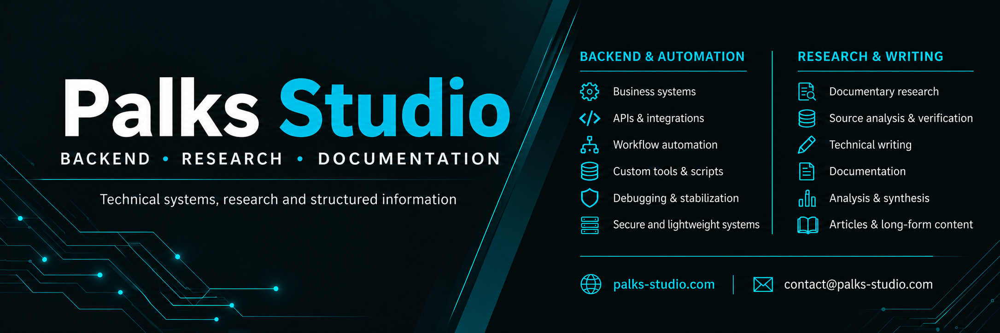

  

> 🇬🇧 English | [🇫🇷 Français](./README_FR.md)

  

# Palks Studio

> This repository is a presentation.  
> It does not contain downloadable source code or production files.

## Backend Development and Business Systems

Design and development of backend systems, business applications and workflow automation tailored to real-world business needs.

Palks Studio helps businesses simplify existing environments by developing new tools, connecting applications through APIs, automating repetitive processes or improving existing backend systems, while keeping architectures maintainable and dependencies under control.

---

## About

Palks Studio is an independent development studio focused on backend systems, business software and technical automation.

Each project is designed around the same principles: simplicity, maintainability, long-term reliability and full control over data and infrastructure.

---

## Core Expertise

- Backend Systems Development  
- Business Applications  
- API Design & Integration  
- Workflow Automation  
- Electronic Invoicing (Factur-X / EN16931)  
- Document Generation (PDF, Factur-X)  
- Payment Integration & Event Handling  
- Application & Server Security

### Technologies

PHP • Python • JavaScript

### Working

🌍 Remote • 🇫🇷 French • 🇬🇧 English

---

## Examples of Projects

The projects below illustrate different systems designed and developed by Palks Studio: business tools, backend systems, automation, data processing and electronic invoicing.

### Billing System

Complete electronic invoicing system deployed directly on the client’s infrastructure:  

- quote → signature → invoice → payment confirmation  
- Factur-X / EN16931 compliant invoice generation  
- PDF generation (client + server)  
- structured archiving without database  
- secure numbering and traceability  
- automatic email sending  
- bilingual FR / EN interface

This project illustrates the design of a complete business system combining business logic, document generation, automation, traceability and data management within an autonomous architecture.

### Candidate System

Autonomous recruitment system with automatic scoring, deployed directly on the client's infrastructure:  

- candidate form → scoring → dashboard → export  
- deterministic 3-level scoring: section, question, answer  
- configurable penalties per campaign  
- multi-campaign management without touching the code  
- JSON storage, no database  
- automatic emails (confirmation + closure)  
- bilingual interface FR / EN

Designed to streamline recruitment workflows while keeping full control over evaluation criteria, candidate data and infrastructure.

[View the System](https://palks-studio.com/en/recruitment-without-saas)

### Data Collection System

Autonomous data collection system designed to run locally or on dedicated infrastructure:

- multi-source searches (DuckDuckGo, Bing, Qwant)  
- website, email and phone number extraction  
- data cleaning, normalization and validation  
- automatic duplicate removal  
- contacted prospect tracking  
- CSV and JSON exports  
- integrated web interface  
- local-first architecture with limited external dependencies

Designed to collect, organize and export structured business data while maintaining full control over infrastructure and collected information.

Available delivery options:

- ZIP package with installation documentation  
- server deployment on request

[View the System](https://palks-studio.com/en/data-collection)

---

## Other custom backend systems

- internal tools and business workflows  
- automation of recurring tasks and processing  
- PDF generation and document processing  
- document systems and structured archiving  
- payment system integration and secure processing  
- database-free backend systems  
- internal interfaces and batch processing  
- deployment on client-owned infrastructure

### Automation Finance

Batch invoicing system based on Factur-X (EN16931):  

- automatic generation from CSV  
- structured invoice production  
- full archiving and traceability  
- secure delivery via token  
- reproducible batch processing

Used to automate recurring invoicing workflows.

[View the Repository](https://github.com/Palks-Studio/automation-system)

---

## Additional tools

**PDF Payment Stamping Engine**  
Tool for processing invoices in batch, integrated into Automation Finance workflows.

- ZIP import  
- automatic PDF detection  
- generation of stamped (paid) invoices  
- individual or batch export

[View the Repository](https://github.com/Palks-Studio/invoice-stamper)

### Other tools

- quote generator (100% browser-based)  
- factur-X electronic invoicing demonstration system  
- static website foundations (HTML/CSS)  
- local chatbots (Flask)  
- documentation frameworks  
- development environment configurations

[View the Resources](https://palks-studio.com/en/resources)

These projects illustrate different approaches implemented by Palks Studio: backend development, automation, data processing, document generation, security, integration and deployment.

The systems presented here are technical projects and do not necessarily represent services currently offered by the studio.

---

## Who it's for

- freelancers and independent professionals  
- artisans and small businesses  
- SMEs and operational teams  
- businesses looking for autonomous systems with fewer dependencies  
- technical projects requiring simple, reliable, and maintainable tools

---

## Approach

- business-driven architectures  
- controlled dependencies  
- simplicity before complexity  
- predictable and maintainable systems  
- long-term reliability  
- full control over data and infrastructure

Every system presented here follows the same philosophy: build software that remains understandable, maintainable and reliable over time.

The objective is not to add complexity, but to remove unnecessary layers whenever possible.

Whenever appropriate, systems are designed to run directly on the client's infrastructure, reducing external dependencies while preserving portability and long-term control.

- https://palks-studio.com
