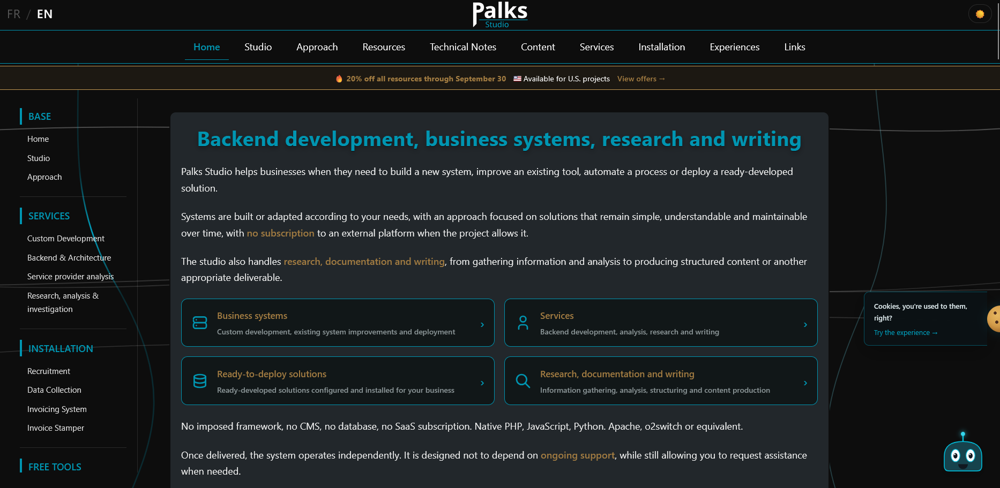

<p align="center">
  
</p>

> 🇬🇧 English | [🇫🇷 Français](./README_FR.md)


[](https://www.youtube.com/@Palks_Studio)
[](https://www.linkedin.com/in/palks-studio/)

<p align="center">
  <a href="https://palks-studio.com">
    
  </a>
</p>

# Palks Studio: Public Website and Technical Systems

> This repository provides a technical presentation and documentation of the project.  
> It does not contain downloadable source code or production files.

This repository documents the public **Palks Studio** website and the main technical systems that support it.

The project combines:

- a lightweight bilingual FR / EN website  
- backend development, business systems, research, and writing services  
- technical systems and tools developed by the studio  
- interactive experiences, visualizations, and simulations  
- tools built around public data  
- PDF and Factur-X document generators  
- a lightweight server-side digital store  
- an autonomous PDF / Factur-X invoicing system  
- secure distribution of downloadable files  
- a local bilingual FR / EN assistant with a JSON knowledge base and deterministic responses

The system runs without a CMS and with limited dependencies.

The architecture relies primarily on standard web technologies, minimal server-side scripts, flat files (JSON / CSV), and, when required, SQLite storage for historical data.

The project clearly separates public interfaces, server-side processing, and internal components.

This documentation covers:

- the overall website architecture  
- the systems and tools developed by the studio  
- publicly accessible experiences and interfaces  
- payment, invoicing, and digital distribution mechanisms  
- technical choices and design principles

Sensitive elements, secrets, production paths, private data, and internal components not intended for public release are not exposed.

This repository is not a turnkey product, framework, or software library.

It serves as a reference for understanding the approach, architecture, tools, and technical choices behind Palks Studio.

---

## About Palks Studio  

Palks Studio designs technical tools, documentation structures,  
and working environments intended to be:  

- readable  
- understandable  
- autonomous  
- maintainable over time  

The emphasis is placed on:  

- functional simplicity  
- control of dependencies  
- transparency of technical choices  
- durability rather than trends  

---

## Project structure

```
/palks-studio-website/
│
├── web/
│    │
│    ├── fr/                                 → Pages du site (FR) / Website pages (EN)
│    ├── en/                                 → Pages du site (FR) / Website pages (EN)
│    │
│    ├── processing/
│    │   ├── document-orchestrator.php       → Orchestrateur de génération Factur-X (FR) / Factur-X generation orchestrator (EN)
│    │   ├── xml-builder.php                 → Construction du XML Factur-X (FR) / Factur-X XML builder (EN)
│    │   ├── pdf-xml-injector.py             → Injection du XML dans le PDF (FR) / XML injection into PDF (EN)
│    │   ├── countries-list.php              → Liste des pays disponibles (FR) / Available countries list (EN)
│    │   └── document-template.php           → Modèle HTML de facture (FR) / Invoice HTML template (EN)
│    │
│    ├── assets/
│    │   ├── brand/                          → Identité visuelle Palks Studio pour facturation (FR) / Palks Studio brand identity for invoicing (EN)
│    │   ├── media/                          → Médias et contenus de démonstration (FR) / Media and demonstration content (EN)
│    │   ├── lib/
│    │   │   └── pdf-client.min.js           → Bibliothèque JavaScript de génération de devis PDF (FR) / JavaScript library for PDF quote generation (EN)
│    │   │
│    │   ├── styles/
│    │   │   ├── main.css                    → Feuille de styles globale (FR) / Global stylesheet (EN)
│    │   │   └── ui.css                      → Feuille de styles interactive (FR) / Interactive stylesheet (EN)
│    │   │
│    │   └── images/                         → Images et visuels (FR) / Images and visuals (EN)
│    │       ├── content/                    → Images des articles (FR) / Article images (EN)
│    │       ├── fav/                        → Favicons (FR) / Favicons (EN)
│    │       ├── vectors/                    → Icônes SVG (FR) / SVG icons (EN)
│    │       └── technical/                  → Images des notes techniques (FR) / Technical notes images (EN)
│    │
│    ├── batch-downloads/
│    │   └── batch-download-access.php       → Point d'accès aux téléchargements batch (FR) / Batch download access endpoint (EN)
│    │
│    ├── documentation/                      → Documents légaux en consultation libre (FR) / Legal documents available for free consultation (EN)
│    ├── store/                              → Fichiers produits numériques (FR) / Digital product files (EN)
│    ├── contract-pdf-generator.php          → Backend génération PDF (FR) / PDF generation backend (EN)
│    ├── batch-upload-engine.php             → Moteur de traitement du formulaire CSV (FR) / CSV upload form processing engine (EN)
│    ├── robots.txt                          → Règles pour moteurs de recherche (FR) / Search engine directives (EN)
│    ├── sitemap.xml                         → Plan du site pour indexation (FR) / Sitemap for indexing (EN)
│    ├── manifest.json                       → Configuration PWA du système (FR) / System PWA configuration (EN)
│    │
│    ├── public-pages/
│    │   ├── contract-client-config-fr.html  → Génération contrat + configuration client (FR)
│    │   ├── contract-client-config-en.html  → Contract generation + client configuration (EN)
│    │   ├── contract-template-fr.html       → Template de contrat (FR)
│    │   ├── contract-template-en.html       → Contract template (EN)
│    │   ├── batch-upload-fr.html            → Formulaire d’envoi CSV client (FR)
│    │   ├── batch-upload-en.html            → Client CSV upload form (EN)
│    │   ├── payment-cancel.html             → Page d’annulation de paiement (FR)/ Payment cancellation page (EN)
│    │   └── payment-success.html            → Page de paiement validé (FR) / Payment success page (EN)
│    │
│    ├── payment-provider/
│    │   ├── checkout-session.php            → Initialisation d’une session de paiement (FR) / Checkout session initialization (EN)
│    │   ├── payment.php                     → Traitement post-paiement (FR) / Post-payment fulfillment handler (EN)
│    │   └── secure-download.php             → Point d’accès sécurisé aux fichiers (FR) / Secure file access endpoint (EN)
│    │
│    ├── carburants/
│    │   └── index.php                       → Interface du radar (FR) / Fuel radar interface (EN)
│    └── fuel/
│        └── index.php                       → Interface du radar (FR) / Fuel radar interface (EN)
│
└── private/
     ├── transactional-mailer.php            → Envoi d’e-mails transactionnels (FR) / Transactional email delivery (EN)
     ├── system-config.php                   → Configuration centralisée des chemins et variables système (FR) / Centralized system paths and variables configuration (EN)
     ├── rate-limit-storage.json             → Stockage des limitations de requêtes IP (FR) / IP request rate limit storage (EN)
     │
     ├── config/
     │   └── download-config.php             → Configuration centrale des téléchargements (FR) / Central download configuration (EN)
     │
     ├── cron-task/
     │   └── cleanup-expired-data.php        → Nettoyage automatique des journaux et fichiers expirés (FR) / Automatic cleanup of logs and expired files (EN)
     │
     ├── tokens/
     │   ├── download-activity.log           → Journal des téléchargements réels (FR) / Download activity log (EN)
     │   └── download-tokens.json            → Stockage des tokens de téléchargement (FR) / Download token storage (EN)
     │
     ├── product/
     │   ├── templates/
     │   │    └── template.php               → Modèle HTML de facture (FR) / Billing HTML template (EN)
     │   │
     │   ├── billing-documents/              → Factures PDF générées (FR) / Generated billing PDF documents (EN)
     │   ├── billing-counter.json            → Compteur persistant de factures (FR) / Persistent billing counter (EN)
     │   ├── counter.php                     → Incrémentation atomique du numéro de facture (FR) / Atomic billing number increment (EN)
     │   ├── billing-html.php                → Génération HTML des factures (FR) / Billing HTML generation (EN)
     │   ├── mailer.php                      → Envoi d’e-mails transactionnels (FR) / Transactional email delivery (EN)
     │   ├── pdf-generator.php               → Génération PDF via mPDF (FR) / PDF generation via mPDF (EN)
     │   ├── facturx-generator.php           → Orchestrateur de génération Factur-X (FR) / Factur-X generation orchestrator (EN)
     │   └── accounting-records.csv          → Journaux comptables CSV (FR) / Accounting CSV records (EN)
     │
     ├── system-logs/                        → Journaux système et erreurs (FR) / System logs and errors (EN)
     ├── mail-library/                       → Bibliothèque d’envoi email (FR) / Email sending library (EN)
     ├── payment-sdk/                        → SDK du prestataire de paiement (FR) / Payment provider SDK (EN)
     ├── dependencies/                       → Dépendances PHP (FR) / PHP dependencies (EN)
     │
     ├── LICENCE.md                          → Conditions d’utilisation et cadre légal (FR)
     ├── LICENSE.md                          → Terms of use and legal framework (EN)
     │
     ├── facturx-watcher/
     │   │
     │   ├── monitor.py                      → Script principal (FR) / Main monitoring script (EN)
     │   ├── xsd_analyzer.py                 → Analyse du Changelog_XSD.md (FR) / Changelog_XSD.md analyzer (EN)
     │   ├── pdf_analyzer.py                 → Analyse comparative des PDF Chorus Pro (FR) / Chorus Pro PDF comparison analyzer (EN)
     │   ├── notifier.php                    → Envoi des alertes et sauvegarde des rapports (FR) / Alert email sender and report saver (EN)
     │   ├── state.json                      → État actuel et précédent (FR) / Current and previous state (EN)
     │   ├── facturx_builder.php             → Générateur XML Factur-X utilisé pour l'analyse (FR) / Factur-X XML generator used for analysis (EN)
     │   ├── mail.php                        → Fonction d'envoi des emails avec pièces jointes (FR) / Email sending function with attachments (EN)
     │   │
     │   ├── downloads/                      → ZIP téléchargés (FR) / Downloaded ZIP archives (EN)
     │   ├── temp/                           → ZIP extraits (FR) / Extracted ZIP archives (EN)
     │   │   ├── v{N}/
     │   │   └── v{N-1}/
     │   │
     │   └── reports/                        → Rapports texte (FR) / Text reports (EN)
     │
     ├── carburants/
     │   │
     │   ├── data-carburants/                → Rapports texte (FR) / Text reports (EN)
     │   └── radar-carburants/               → Collecte des données carburants (FR) / Fuel data collection (EN)
     │       └── data-collect.php            → Collecteur quotidien (FR) / Daily data collector (EN)
     │
     └── docs/
         ├── VUE_D_ENSEMBLE.md               → Vue d’ensemble du système (FR)
         ├── OVERVIEW.md                     → System Overview (EN)
         ├── FACTURATION.md                  → Gestion de la facturation (FR)
         ├── INVOICES.md                     → Billing Management (EN)
         ├── PROJECT-OVERVIEW_FR.md          → Vue d’ensemble du projet (FR)
         ├── PROJECT-OVERVIEW.md             → Project Overview (EN)
         ├── README_FR.md                    → Présentation générale (FR)
         └── README.md                       → General Overview (EN)
```

```
chatbot.com
│
├── data/
│   └── knowledge_base.json  → Chatbot FR / EN knowledge base
│
├── chatbot.php              → PHP entry point between the website and the chatbot
├── chatbot.py               → Chatbot Python launcher / interface
├── demo-en.html             → English demo page
├── demo-fr.html             → French demo page
├── engine.py                → Main logic, matching, fallbacks and responses
├── storage.py               → Local storage management
└── widget.html              → Embeddable chatbot widget interface
```

---

## Architecture Overview

The system is built around a deliberately lean and modular architecture:

- Primarily static frontend (HTML / CSS / JavaScript)  
- Server-side PHP endpoints  
- Storage primarily based on flat files (JSON / CSV)  
- SQLite storage for specific tools requiring historical data  
- External payment provider used solely for transaction processing  
- Internal invoicing and Factur-X generation pipeline  
- Local FR / EN Python assistant without a web framework or external AI API  
- Separation between public interfaces and private processing

Design objectives:

- deterministic behavior  
- operation traceability  
- minimal dependencies  
- long-term maintainability  
- clear separation of components

### Layered Architecture

The system clearly separates:

- the public web interface  
- publicly accessible tools and interactive experiences  
- controlled ingestion points  
- processing and data kept on the private server side

The presence of web forms and interfaces does not mean that sensitive processing is performed on the public layer.

Financial operations are triggered after payment confirmation and processed server-side.

Invoice and Factur-X document generation is handled entirely by the internal Palks Studio system.

The payment provider is used solely for transaction processing and payment confirmation.

PDF invoice creation, generation of the EN16931-compliant Factur-X XML file, association of billing data, and document archiving are handled by the internal invoicing pipeline, independently of the payment provider's invoicing system.

### Related Systems and Tools

The project relies on several specialized components:

- a browser-based PDF quote generator, independent from the invoicing system  
- a publicly accessible Factur-X generator / demo  
- an internal PDF / Factur-X invoice generation engine  
- an automated invoicing system triggered by payment  
- a batch processing system for grouped operations  
- a technical watcher monitoring Factur-X-related changes  
- a public-data monitoring tool with SQLite historical storage  
- interactive experiences, visualizations, and simulations available through the website

These components remain separate in order to preserve a modular architecture, limit dependencies, and simplify maintenance.

---

## The Palks Studio Website (Public Version)

The public website includes:

- the studio, its services, and its approach  
- business systems developed by Palks Studio  
- publicly accessible technical tools  
- interactive experiences, visualizations, and simulations  
- tools based on public data  
- resources and publications  
- technical notes and engineering insights  
- legal and informational pages  
- the digital store

### PDF Quote Generator

A free bilingual PDF quote generator is available directly on the website.

It runs entirely client-side (JavaScript + jsPDF) and does not transmit any data to a server. It can be used to create professional quotes with multiple service lines, automatic subtotal / VAT / total calculations, and direct PDF export.

The generator is completely independent from the invoicing pipeline
(Payment → Confirmation → Invoice → Token → Download) and does not create transactions or server-side archives.

### Factur-X Demo

A Factur-X invoice generation demo is available on the website.

This demo is intentionally limited to ensure service stability and prevent abuse.

The demonstration pipeline includes:

- rendering the HTML invoice template  
- generating the EN16931-compliant Factur-X XML  
- embedding the XML into the PDF

For professional use, a complete and compliant integration can be implemented according to specific requirements.

### Interactive Experiences

The website provides interactive experiences designed to explore different topics through direct interaction, visualization, or simulation.

These include interactive interfaces, visualizations, forward-looking simulations, and tools built from public data.

These experiences are designed as standalone tools that make information, mechanisms, and developments easier to observe.

### Public Data Tools

Some tools use public data sources to track and visualize changes over time.

When required, collected data is stored in SQLite to build a historical dataset that can be used by the public interfaces.

Different language versions use the same collection systems and underlying data.

### Resources and Digital Distribution

Some resources are provided as documents, archives, or downloadable files, particularly when the content includes:

- multiple files  
- complete structures  
- examples or educational materials  
- reusable tools or templates

These resources are organized into dedicated areas to preserve architectural clarity and deliverable traceability.

Files are distributed through a secure system using temporary, single-use links, with server-side logging.

### Local Bilingual Assistant

The website includes a local FR / EN assistant designed to guide visitors through Palks Studio's services, systems, resources, and content.

The engine operates without an external artificial intelligence service, without a Python web framework, and without a dedicated database.

The architecture deliberately relies on simple components:

- web interface  
- server-side entry point  
- locally executed Python engine  
- system execution and integration scripts  
- local JSON knowledge base  
- file-based storage  
- deterministic matching and fallback logic

No permanent Python application server is required.

This architecture keeps the assistant lightweight, controllable, and fully hosted on the studio's infrastructure, without relying on an external AI API.

---

## What This Repository Is

- Public documentation of the Palks Studio website and its architecture  
- A technical and documentation showcase  
- A presentation of the tools, systems, and interactive experiences developed by the studio  
- A public reference point  
- A resource for understanding the project  
- A demonstration of structure and methodology  
- A concrete example of a lean, modular, CMS-free architecture

---

## What This Repository Is Not

- A repository containing production files  
- A distribution of the source code for internal systems  
- An e-commerce framework  
- A SaaS platform  
- A generic turnkey product  
- A software library  
- A support or contractual update platform

Keys, secrets, production paths, private data, and internal components not intended for public release are not exposed here.

---

## Design Principles

Palks Studio is built around a few consistent principles:

- functional simplicity  
- dependency control  
- technical transparency  
- readable code and structures  
- separation of responsibilities  
- long-term stability over complexity

---

## Transparency and Approach

Palks Studio chooses to:

- document its projects thoroughly  
- explain technical choices and limitations  
- avoid vague promises  
- avoid hiding the work behind marketing  
- prioritize readability and traceability over complexity

The documentation is designed to make the project's approach and technical choices understandable without exposing sensitive elements of the production infrastructure.

This repository is an integral part of that commitment to transparency.

---

© Palks Studio — see LICENSE.md  
- https://palks-studio.com
