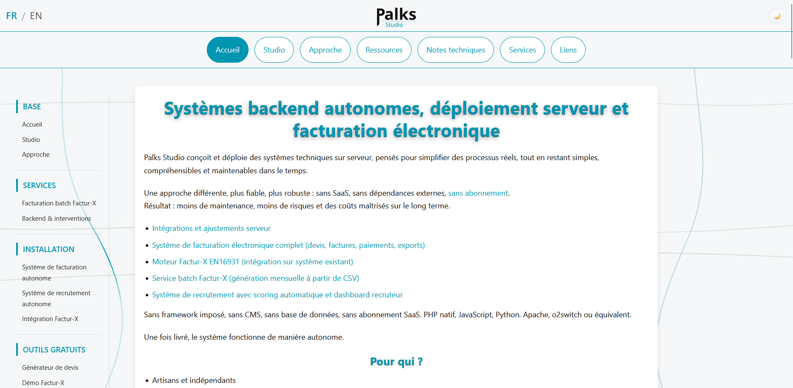

<p align="center">
  
</p>

> 🇫🇷 Français | [🇬🇧 English](./README.md)


<p align="center">
  <a href="https://palks-studio.com">
    
  </a>
</p>

# Palks Studio — Site statique + boutique numérique  

> Ce dépôt constitue une présentation technique et une documentation du projet.  
> Il ne contient pas de code source téléchargeable ni de fichiers de production.

Ce dépôt contient le site public de **Palks Studio**, qui combine :  

- un site statique en HTML, sobre et sans tracking  
- une boutique numérique légère côté serveur  
- un système autonome de facturation PDF  
- une distribution sécurisée de fichiers téléchargeables par token  

L’ensemble fonctionne sans CMS, sans base de données et sans dépendance SaaS inutile,  
en s’appuyant uniquement sur des fichiers plats (JSON/CSV) et des scripts PHP minimalistes.  

Le dépôt regroupe :  

- le site public (pages, styles, images, contenus)  
- les composants de paiement et de livraison numérique  
- ainsi que les documents accessibles publiquement  
dans un objectif de clarté, de lisibilité et de transparence  

Ce dépôt n’est pas un produit clé en main, ni un framework, ni une bibliothèque logicielle.  
Il s’agit d’un support de référence permettant de comprendre la démarche,  
les outils et les choix techniques portés par Palks Studio.  

---

## À propos de Palks Studio  

Palks Studio conçoit des outils techniques, des structures de documentation  
et des environnements de travail pensés pour être :  

- lisibles  
- compréhensibles  
- autonomes  
- maintenables dans le temps  

L’accent est mis sur :  

- la simplicité fonctionnelle  
- la maîtrise des dépendances  
- la transparence des choix techniques  
- la durabilité plutôt que la mode  

---

## Structure du projet

```
/palks-studio-website/
│
├── fr/
│   ├── index.html                            → Accueil principal
│   ├── services.html                         → Page de présentation des services
│   ├── facturation-sans-saas.html            → Système de facturation autonome
│   ├── facturation-batch-facturx.html        → Service de facturation batch Factur-X
│   ├── facturation-sans-saas.html            → Service de facturation autonome sans SaaS (devis, factures, paiements)
│   ├── sans-abonnement.html                  → Approche sans abonnement
│   ├── systemes-techniques-autonomes.html    → Développement backend sur mesure
│   ├── studio.html                           → Présentation de Palks Studio
│   ├── approche.html                         → Approche et principes de travail
│   ├── ressources.html                       → Ressources techniques
│   ├── generateur-devis.html                 → Générateur de devis PDF gratuit
│   ├── static-site.html                      → Socle de site statique
│   ├── chatbot-flask.html                    → Chatbot Flask auto-hébergé
│   ├── framework-documentation.html          → Framework de documentation
│   ├── pack-environnement-vscode.html        → Pack environnement VS Code
│   ├── liens.html                            → Liens, ressources, produits
│   ├── mentions-legales.html                 → Mentions légales (FR) / Legal notice (EN)
│   ├── contact.html                          → Page de contact
│   ├── notes-techniques.html*                → Notes techniques
│   ├── cgv.html                              → Conditions générales de vente
│   ├── faq.html                              → Foire aux questions
│   └── politique-confidentialite.html        → Politique de confidentialité (FR) / Privacy policy (EN)    facturation-sans-saas
│
├── en/
│   ├── index.html                            → Home page
│   ├── services.html                         → Services page
│   ├── invoicing-without-saas.html           → Autonomous invoicing system
│   ├── batch-invoicing-facturx.html          → Factur-X batch billing service
│   ├── invoicing-without-saas.html           → Autonomous invoicing service without SaaS (quotes, invoices, payments)
│   ├── no-subscription.html                  → No-subscription approach
│   ├── autonomous-backend-systems.html       → Custom backend development
│   ├── studio.html                           → Studio overview
│   ├── approach.html                         → Method & principles
│   ├── ressources.html                       → Technical resources
│   ├── quote-generator.html                  → Free PDF quote generator
│   ├── static-site.html                      → Professional static foundation
│   ├── flask-chatbot.html                    → Self-hosted Flask chatbot
│   ├── documentation-framework.html          → Documentation framework
│   ├── vscode-environment-pack.html          → VS Code environment pack
│   ├── links.html                            → Links & resources
│   ├── contact.html                          → Contact page
│   ├── technical-notes.html*                 → Technical notes
│   ├── faq.html                              → Frequently Asked Questions
│   └── terms.html                            → Terms and Conditions
│
├── assets/
│   ├── css/
│   │   └── style.css                         → Global stylesheet (FR) / Feuille de styles globale (EN)
│   └── img/                                  → Images et visuels (FR) / Images and visuals (EN)
│
├── robots.txt                                → Règles pour moteurs de recherche (FR) / Search engine directives (EN)
├── sitemap.xml                               → Plan du site pour indexation (FR) / Sitemap for indexing (EN)
│
├── LICENCE.md                                → Conditions d’utilisation et cadre légal (FR)
├── LICENSE.md                                → Terms of use and legal Framework (EN)
│
├── generate-contract.php                     → Backend génération PDF (FR) / PDF generation backend (EN)
├── upload-batch.php                          → Moteur de traitement du formulaire CSV (FR) / CSV upload form processing engine (EN)
│
├── downloads_tokens/
│   ├── downloads.log                         → Journal des téléchargements réels (FR) / Download activity log (EN)
│   ├── security.log                          → Journal des accès sécurisés aux fichiers (FR) / Secure download access log (EN)
│   └── tokens.json                           → Stockage des tokens de téléchargement (FR) / Download token storage (EN)
│
├── config/
│   └── download.php                          → Configuration centrale des téléchargements (FR) / Central download configuration (EN)
│
├── library/
│   ├── contact-contrat-fr.html               → Génération contrat + configuration client (FR)
│   ├── contact-contrat-en.html               → Contract + client configuration generation (EN)
│   ├── contrat-template-fr.html              → Template de contrat (FR)
│   ├── contrat-template-en.html              → Contract template (EN)
│   ├── upload-batch-fr.html                  → Formulaire d’envoi CSV client (FR)
│   ├── upload-batch-en.html                  → Client CSV upload form (EN)
│   ├── cancel.html                           → Page d’annulation de paiement (FR)/ Payment cancellation page (EN)
│   ├── success.html                          → Page de paiement validé (FR) / Payment success page (EN)
│   ├── counter.json                          → Compteur persistant de factures (FR) / Persistent invoice counter (EN)
│   ├── get_counter.php                       → Lecture sécurisée du compteur de factures (FR) / Secure invoice counter reader (EN)
│   ├── lib_*.php                             → Incrémentation atomique du numéro de facture (FR) / Secure invoice counter reader (EN)
│   ├── lib_*.php                             → Génération HTML des factures (FR) / Atomic invoice number increment (EN)
│   ├── lib_*.php                             → Envoi e-mails transactionnels (FR) / Transactional email delivery (EN)
│   ├── lib_*.php                             → Génération PDF via DomPDF (FR) / PDF generation via DomPDF (EN)
│   └── template_invoice.html                 → Template HTML de facture (FR) / Invoice HTML template (EN)
│
├── docs/
│   ├── VUE_D_ENSEMBLE.md                     → Vue d’ensemble du système (FR)
│   ├── OVERVIEW.md                           → System Overview (EN)
│   ├── PROJECT-OVERVIEW_FR.md                → Vue d’ensemble du projet (FR)
│   ├── PROJECT-OVERVIEW.md                   → Project Overview (EN)
│   ├── README_FR.md                          → Présentation générale (FR)
│   └── README.md                             → General Overview (EN)
│
├── products/
│   └── (store files)                         → Fichiers produits numériques (FR) / Digital product files (EN)
│
└── endpoint/
    ├── endpoint_a.php                        → Initialisation d’une session de paiement (FR) / Checkout session initialization (EN)
    ├── endpoint_b.php                        → Traitement des événements de paiement (FR) / Payment event handler (EN)
    ├── endpoint_c.php                        → Traitement post-paiement (FR) / Post-payment fulfillment handler (EN)
    └── endpoint_d.php                        → Point d’accès sécurisé aux fichiers (FR) / Secure file access endpoint (EN)
```


---

## Architecture (résumé)

Le système repose sur une architecture volontairement minimale :  

- Frontend statique (HTML/CSS)  
- Endpoints PHP côté serveur  
- Stockage fichiers plats (JSON / CSV)  
- Stripe comme processeur de paiement  
- Aucune base de données

Objectifs techniques :  

- comportement déterministe  
- traçabilité des opérations  
- dépendances minimales  
- maintenabilité long terme

### Architecture en couches

Le système distingue clairement :  

- la façade web publique (`palks-studio.com`)  
- les points d’ingestion contrôlés (contrat, upload CSV)  
- le moteur de facturation privé (`automation_finance/`)

La présence des formulaires côté site ne signifie  
pas une exécution de la facturation côté web.

Toute génération financière reste strictement  
pilotée par les scripts CLI du moteur.

---

## Le site Palks Studio (version publique)

Les pages du site présentent :  

- le studio et sa démarche  
- les ressources proposées  
- les fondations conceptuelles  
- les outils techniques développés  
- les notes techniques et réflexions d’ingénierie  
- les pages légales et informatives  
- ainsi que l’accès à la boutique numérique  
- ainsi qu'un générateur de devis PDF gratuit, bilingue et entièrement côté navigateur.

Cet outil fonctionne entièrement côté client (JavaScript + jsPDF) et ne transmet  
aucune donnée à un serveur. Il permet de créer rapidement un devis professionnel  
avec plusieurs lignes de prestations, calcul automatique HT / TVA / TTC,  
et export direct en PDF.

Le générateur est totalement indépendant du pipeline de facturation  
(Stripe → Webhook → Facture → Token → Téléchargement) et ne crée  
ni transaction ni archive côté serveur.

### Ressources et distribution numérique

Certaines ressources sont fournies sous forme de documents, archives ou fichiers téléchargeables, notamment lorsque le contenu comprend :  

- plusieurs fichiers  
- des structures complètes  
- des exemples ou supports pédagogiques  
- des outils ou gabarits réutilisables  

Ces éléments sont regroupés dans des dossiers dédiés afin de préserver  
la clarté du dépôt et la traçabilité des livrables.

La distribution des fichiers se fait via un système sécurisé à lien temporaire  
et usage unique, journalisé côté serveur.

---

## Ce que ce dépôt est

- Un site public statique + boutique numérique légère  
- Une vitrine technique et documentaire  
- Un point de référence public  
- Un support de compréhension  
- Une démonstration de structure et de méthode  
- Un exemple concret d’architecture sobre sans CMS ni base de données

---

## Ce que ce dépôt n’est pas

- Un framework e-commerce  
- Une plateforme SaaS  
- Un produit générique clé en main  
- Une bibliothèque logicielle  
- Un espace de support ou de mises à jour contractuelles  

Les clés, secrets et certains chemins de production ne sont pas exposés ici.

---

## Principes de conception

Palks Studio repose sur quelques principes constants :  

- simplicité fonctionnelle  
- maîtrise des dépendances  
- transparence technique  
- lisibilité du code et des structures  
- stabilité dans le temps plutôt que complexité

---

## Transparence et démarche

Palks Studio fait le choix de :  

- documenter sérieusement ses projets  
- expliquer les choix et les limites  
- éviter les promesses floues  
- ne pas masquer le travail derrière du marketing  
- privilégier la lisibilité et la traçabilité plutôt que la complexité  

Le code, les structures et la documentation sont pensés pour être compris  
avant toute décision d’utilisation ou d’achat.

Ce dépôt participe pleinement à cette démarche de transparence.

---

© Palks Studio — voir LICENSE.md  
- https://palks-studio.com
