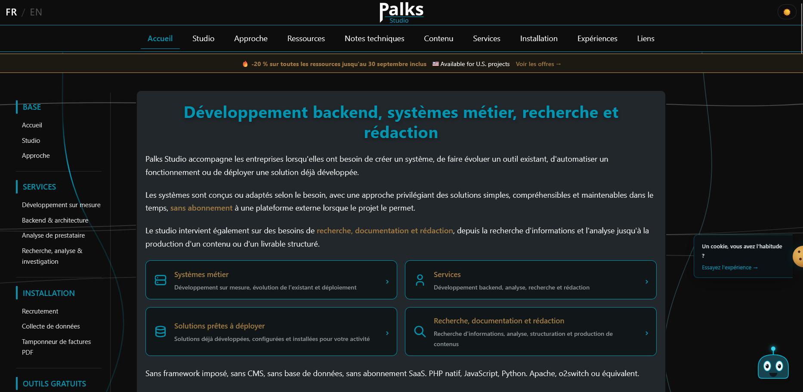

<p align="center">
  
</p>

> 🇫🇷 Français | [🇬🇧 English](./README.md)


[](https://www.youtube.com/@Palks_Studio)
[](https://www.linkedin.com/in/palks-studio/)

<p align="center">
  <a href="https://palks-studio.com">
    
  </a>
</p>

# Palks Studio : Site public et systèmes techniques

> Ce dépôt constitue une présentation technique et une documentation du projet.  
> Il ne contient pas de code source téléchargeable ni de fichiers de production.

Ce dépôt documente le site public de **Palks Studio** et les principaux systèmes techniques qui l'accompagnent.

Le projet combine notamment :

- un site bilingue FR / EN, sobre et léger  
- des services de développement backend, systèmes métier, recherche et rédaction  
- des systèmes et outils techniques développés par le studio  
- des expériences interactives, visualisations et simulations  
- des outils exploitant des données publiques  
- des générateurs de documents PDF et Factur-X  
- une boutique numérique légère côté serveur  
- un système autonome de facturation PDF / Factur-X  
- une distribution sécurisée de fichiers téléchargeables  
- un assistant local bilingue FR / EN avec base de connaissances JSON et réponses déterministes

L’ensemble fonctionne sans CMS et avec des dépendances limitées.

L’architecture repose principalement sur des technologies web standards, des scripts serveur minimalistes, des fichiers plats (JSON / CSV) et, lorsque cela est nécessaire, un stockage SQLite pour conserver des données historiques.

Le projet distingue clairement les interfaces publiques, les traitements côté serveur et les composants internes.

Cette documentation présente notamment :

- l’architecture générale du site  
- les systèmes et outils développés  
- les expériences et interfaces accessibles publiquement  
- les mécanismes de paiement, facturation et distribution numérique  
- les choix techniques et principes de conception

Les éléments sensibles, secrets, chemins de production, données privées et composants internes non destinés à être publiés ne sont pas exposés.

Ce dépôt n’est pas un produit clé en main, ni un framework, ni une bibliothèque logicielle.

Il constitue un support de référence permettant de comprendre la démarche, l’architecture, les outils et les choix techniques portés par Palks Studio.

---

## À propos de Palks Studio  

Palks Studio conçoit des outils techniques, des structures de documentation  
et des environnements de travail pensés pour être :  

- lisibles  
- compréhensibles  
- autonomes  
- maintenables dans le temps  

L’accent est mis sur :  

- la simplicité fonctionnelle  
- la maîtrise des dépendances  
- la transparence des choix techniques  
- la durabilité plutôt que la mode  

---

## Structure du projet

```
/palks-studio-website/
│
├── web/
│    │
│    ├── fr/                                 → Pages du site (FR) / Website pages (EN)
│    ├── en/                                 → Pages du site (FR) / Website pages (EN)
│    │
│    ├── processing/
│    │   ├── document-orchestrator.php       → Orchestrateur de génération Factur-X (FR) / Factur-X generation orchestrator (EN)
│    │   ├── xml-builder.php                 → Construction du XML Factur-X (FR) / Factur-X XML builder (EN)
│    │   ├── pdf-xml-injector.py             → Injection du XML dans le PDF (FR) / XML injection into PDF (EN)
│    │   ├── countries-list.php              → Liste des pays disponibles (FR) / Available countries list (EN)
│    │   └── document-template.php           → Modèle HTML de facture (FR) / Invoice HTML template (EN)
│    │
│    ├── assets/
│    │   ├── brand/                          → Identité visuelle Palks Studio pour facturation (FR) / Palks Studio brand identity for invoicing (EN)
│    │   ├── media/                          → Médias et contenus de démonstration (FR) / Media and demonstration content (EN)
│    │   ├── lib/
│    │   │   └── pdf-client.min.js           → Bibliothèque JavaScript de génération de devis PDF (FR) / JavaScript library for PDF quote generation (EN)
│    │   │
│    │   ├── styles/
│    │   │   ├── main.css                    → Feuille de styles globale (FR) / Global stylesheet (EN)
│    │   │   └── ui.css                      → Feuille de styles interactive (FR) / Interactive stylesheet (EN)
│    │   │
│    │   └── images/                         → Images et visuels (FR) / Images and visuals (EN)
│    │       ├── content/                    → Images des articles (FR) / Article images (EN)
│    │       ├── fav/                        → Favicons (FR) / Favicons (EN)
│    │       ├── vectors/                    → Icônes SVG (FR) / SVG icons (EN)
│    │       └── technical/                  → Images des notes techniques (FR) / Technical notes images (EN)
│    │
│    ├── batch-downloads/
│    │   └── batch-download-access.php       → Point d'accès aux téléchargements batch (FR) / Batch download access endpoint (EN)
│    │
│    ├── documentation/                      → Documents légaux en consultation libre (FR) / Legal documents available for free consultation (EN)
│    ├── store/                              → Fichiers produits numériques (FR) / Digital product files (EN)
│    ├── contract-pdf-generator.php          → Backend génération PDF (FR) / PDF generation backend (EN)
│    ├── batch-upload-engine.php             → Moteur de traitement du formulaire CSV (FR) / CSV upload form processing engine (EN)
│    ├── robots.txt                          → Règles pour moteurs de recherche (FR) / Search engine directives (EN)
│    ├── sitemap.xml                         → Plan du site pour indexation (FR) / Sitemap for indexing (EN)
│    ├── manifest.json                       → Configuration PWA du système (FR) / System PWA configuration (EN)
│    │
│    ├── public-pages/
│    │   ├── contract-client-config-fr.html  → Génération contrat + configuration client (FR)
│    │   ├── contract-client-config-en.html  → Contract generation + client configuration (EN)
│    │   ├── contract-template-fr.html       → Template de contrat (FR)
│    │   ├── contract-template-en.html       → Contract template (EN)
│    │   ├── batch-upload-fr.html            → Formulaire d’envoi CSV client (FR)
│    │   ├── batch-upload-en.html            → Client CSV upload form (EN)
│    │   ├── payment-cancel.html             → Page d’annulation de paiement (FR)/ Payment cancellation page (EN)
│    │   └── payment-success.html            → Page de paiement validé (FR) / Payment success page (EN)
│    │
│    ├── payment-provider/
│    │   ├── checkout-session.php            → Initialisation d’une session de paiement (FR) / Checkout session initialization (EN)
│    │   ├── payment.php                     → Traitement post-paiement (FR) / Post-payment fulfillment handler (EN)
│    │   └── secure-download.php             → Point d’accès sécurisé aux fichiers (FR) / Secure file access endpoint (EN)
│    │
│    ├── carburants/
│    │   └── index.php                       → Interface du radar (FR) / Fuel radar interface (EN)
│    ├── fuel/
│    │   └── index.php                       → Interface du radar (FR) / Fuel radar interface (EN)
│    │
│    ├── cyber-en/
│    │   └── index.php                       → Interface du radar (FR) / Fuel radar interface (EN)
│    └── cyber-fr/
│        └── index.php                       → Interface du radar (FR) / Fuel radar interface (EN)
│
└── private/
     ├── transactional-mailer.php            → Envoi d’e-mails transactionnels (FR) / Transactional email delivery (EN)
     ├── system-config.php                   → Configuration centralisée des chemins et variables système (FR) / Centralized system paths and variables configuration (EN)
     ├── rate-limit-storage.json             → Stockage des limitations de requêtes IP (FR) / IP request rate limit storage (EN)
     │
     ├── config/
     │   └── download-config.php             → Configuration centrale des téléchargements (FR) / Central download configuration (EN)
     │
     ├── cron-task/
     │   └── cleanup-expired-data.php        → Nettoyage automatique des journaux et fichiers expirés (FR) / Automatic cleanup of logs and expired files (EN)
     │
     ├── tokens/
     │   ├── download-activity.log           → Journal des téléchargements réels (FR) / Download activity log (EN)
     │   └── download-tokens.json            → Stockage des tokens de téléchargement (FR) / Download token storage (EN)
     │
     ├── product/
     │   ├── templates/
     │   │    └── template.php               → Modèle HTML de facture (FR) / Billing HTML template (EN)
     │   │
     │   ├── billing-documents/              → Factures PDF générées (FR) / Generated billing PDF documents (EN)
     │   ├── billing-counter.json            → Compteur persistant de factures (FR) / Persistent billing counter (EN)
     │   ├── counter.php                     → Incrémentation atomique du numéro de facture (FR) / Atomic billing number increment (EN)
     │   ├── billing-html.php                → Génération HTML des factures (FR) / Billing HTML generation (EN)
     │   ├── mailer.php                      → Envoi d’e-mails transactionnels (FR) / Transactional email delivery (EN)
     │   ├── pdf-generator.php               → Génération PDF via mPDF (FR) / PDF generation via mPDF (EN)
     │   ├── facturx-generator.php           → Orchestrateur de génération Factur-X (FR) / Factur-X generation orchestrator (EN)
     │   └── accounting-records.csv          → Journaux comptables CSV (FR) / Accounting CSV records (EN)
     │
     ├── system-logs/                        → Journaux système et erreurs (FR) / System logs and errors (EN)
     ├── mail-library/                       → Bibliothèque d’envoi email (FR) / Email sending library (EN)
     ├── payment-sdk/                        → SDK du prestataire de paiement (FR) / Payment provider SDK (EN)
     ├── dependencies/                       → Dépendances PHP (FR) / PHP dependencies (EN)
     │
     ├── LICENCE.md                          → Conditions d’utilisation et cadre légal (FR)
     ├── LICENSE.md                          → Terms of use and legal framework (EN)
     │
     ├── facturx-watcher/
     │   │
     │   ├── monitor.py                      → Script principal (FR) / Main monitoring script (EN)
     │   ├── xsd_analyzer.py                 → Analyse du Changelog_XSD.md (FR) / Changelog_XSD.md analyzer (EN)
     │   ├── pdf_analyzer.py                 → Analyse comparative des PDF Chorus Pro (FR) / Chorus Pro PDF comparison analyzer (EN)
     │   ├── notifier.php                    → Envoi des alertes et sauvegarde des rapports (FR) / Alert email sender and report saver (EN)
     │   ├── state.json                      → État actuel et précédent (FR) / Current and previous state (EN)
     │   ├── facturx_builder.php             → Générateur XML Factur-X utilisé pour l'analyse (FR) / Factur-X XML generator used for analysis (EN)
     │   ├── mail.php                        → Fonction d'envoi des emails avec pièces jointes (FR) / Email sending function with attachments (EN)
     │   │
     │   ├── downloads/                      → ZIP téléchargés (FR) / Downloaded ZIP archives (EN)
     │   ├── temp/                           → ZIP extraits (FR) / Extracted ZIP archives (EN)
     │   │   ├── v{N}/
     │   │   └── v{N-1}/
     │   │
     │   └── reports/                        → Rapports texte (FR) / Text reports (EN)
     │
     ├── carburants/
     │   │
     │   ├── data-carburants/                → Rapports texte (FR) / Text reports (EN)
     │   └── radar-carburants/               → Collecte des données carburants (FR) / Fuel data collection (EN)
     │       └── data-collect.php            → Collecteur quotidien (FR) / Daily data collector (EN)
     │
     └── docs/
         ├── VUE_D_ENSEMBLE.md               → Vue d’ensemble du système (FR)
         ├── OVERVIEW.md                     → System Overview (EN)
         ├── FACTURATION.md                  → Gestion de la facturation (FR)
         ├── INVOICES.md                     → Billing Management (EN)
         ├── PROJECT-OVERVIEW_FR.md          → Vue d’ensemble du projet (FR)
         ├── PROJECT-OVERVIEW.md             → Project Overview (EN)
         ├── README_FR.md                    → Présentation générale (FR)
         └── README.md                       → General Overview (EN)
```

```
chatbot.com
│
├── data/
│   └── knowledge_base.json  → Base de connaissances FR / EN du chatbot
│
├── chatbot.php              → Point d'entrée PHP entre le site et le chatbot
├── chatbot.py               → Lancement / interface Python du chatbot
├── demo-en.html             → Page de démonstration anglaise
├── demo-fr.html             → Page de démonstration française
├── engine.py                → Logique principale, matching, fallbacks et réponses
├── storage.py               → Gestion du stockage local
└── widget.html              → Interface du widget chatbot intégrable
```

---

## Résumé de l’architecture

Le système repose sur une architecture volontairement sobre et modulaire :

- Frontend principalement statique (HTML / CSS / JavaScript)  
- Endpoints PHP côté serveur  
- Stockage principalement basé sur des fichiers plats (JSON / CSV)  
- Stockage SQLite pour certains outils nécessitant un historique de données  
- Prestataire de paiement externe utilisé uniquement pour la transaction  
- Pipeline interne de facturation et génération Factur-X  
- Assistant local Python FR / EN sans framework web ni API d’IA externe  
- Séparation entre les interfaces publiques et les traitements privés

Objectifs de conception :

- comportement déterministe  
- traçabilité des opérations  
- dépendances minimales  
- maintenabilité à long terme  
- séparation claire des composants

### Architecture en couches

Le système distingue clairement :

- la façade web publique  
- les outils et expériences accessibles publiquement  
- les points d’ingestion contrôlés  
- les traitements et données conservés côté serveur privé

La présence de formulaires et d’interfaces web ne signifie pas que les traitements sensibles sont exécutés sur la couche publique.

Les opérations financières sont déclenchées après confirmation du paiement et traitées côté serveur.

La génération des factures et des documents Factur-X est entièrement gérée par le système interne Palks Studio.

Le prestataire de paiement intervient uniquement pour la gestion de la transaction et la confirmation du paiement.

La création de la facture PDF, la génération du fichier XML Factur-X conforme à la norme EN16931, l’association des données de facturation et l’archivage des documents sont gérés par le pipeline de facturation interne, indépendamment du système de facturation du prestataire de paiement.

### Systèmes et outils associés

Le projet s’appuie sur plusieurs briques spécialisées :

- un générateur de devis PDF côté navigateur, indépendant du système de facturation  
- un générateur / démonstrateur Factur-X accessible publiquement  
- un moteur interne de génération de factures PDF / Factur-X  
- un système de facturation automatisée déclenché par paiement  
- un système de traitement batch pour les opérations groupées  
- un watcher technique chargé de surveiller les évolutions liées à Factur-X  
- un outil de suivi basé sur des données publiques et un historique SQLite  
- des expériences interactives, visualisations et simulations accessibles depuis le site

Ces composants sont séparés afin de conserver une architecture modulaire, limiter les dépendances et faciliter la maintenance.

---

## Le site Palks Studio (version publique)

Le site public présente notamment :

- le studio, ses services et sa démarche  
- les systèmes métier développés par Palks Studio  
- les outils techniques accessibles publiquement  
- les expériences interactives, visualisations et simulations  
- les outils fondés sur des données publiques  
- les ressources et publications  
- les notes techniques et réflexions d’ingénierie  
- les pages légales et informatives  
- la boutique numérique

### Générateur de devis PDF

Un générateur de devis PDF gratuit et bilingue est disponible directement sur le site.

Il fonctionne entièrement côté client (JavaScript + jsPDF) et ne transmet aucune donnée à un serveur. Il permet de créer des devis professionnels avec plusieurs lignes de prestations, calcul automatique HT / TVA / TTC et export direct en PDF.

Le générateur est totalement indépendant du pipeline de facturation
(Paiement → Confirmation → Facture → Token → Téléchargement) et ne crée aucune transaction ni archive côté serveur.

### Démonstration Factur-X

Une démonstration de génération de facture Factur-X est disponible sur le site.

Cette démonstration est volontairement limitée afin de garantir la stabilité du service et d’éviter tout usage abusif.

Le pipeline de démonstration comprend :

- rendu du template HTML de facture  
- construction du XML Factur-X conforme EN16931  
- injection du XML dans le PDF

Pour une utilisation professionnelle, une intégration complète et conforme peut être mise en place selon les besoins.

### Expériences interactives

Le site propose des expériences interactives permettant d’explorer différents sujets par la manipulation, la visualisation ou la simulation.

Elles comprennent notamment des interfaces interactives, des visualisations, des simulations prospectives et des outils construits à partir de données publiques.

Ces expériences sont conçues comme des outils autonomes permettant de rendre des informations, mécanismes ou évolutions plus directement observables.

### Outils fondés sur des données publiques

Certains outils exploitent des sources de données publiques afin de suivre et visualiser leur évolution dans le temps.

Lorsque cela est nécessaire, les données collectées sont conservées dans un stockage SQLite afin de constituer un historique exploitable par les interfaces publiques.

Les différentes versions linguistiques utilisent les mêmes systèmes de collecte et les mêmes données sous-jacentes.

### Ressources et distribution numérique

Certaines ressources sont fournies sous forme de documents, archives ou fichiers téléchargeables, notamment lorsque le contenu comprend :

- plusieurs fichiers  
- des structures complètes  
- des exemples ou supports pédagogiques  
- des outils ou gabarits réutilisables

Ces éléments sont regroupés dans des espaces dédiés afin de préserver la clarté de l’architecture et la traçabilité des livrables.

La distribution des fichiers se fait via un système sécurisé à lien temporaire et usage unique, journalisé côté serveur.

### Assistant local bilingue

Le site intègre un assistant local FR / EN conçu pour orienter les visiteurs dans les services, systèmes, ressources et contenus de Palks Studio.

Le moteur fonctionne sans service d’intelligence artificielle externe, sans framework web Python et sans base de données dédiée.

L’architecture repose volontairement sur des composants simples :

- interface web  
- point d’entrée côté serveur  
- moteur Python exécuté localement  
- scripts d’exécution et d’intégration système  
- base de connaissances JSON locale  
- stockage fichier  
- logique déterministe de matching et de fallbacks

Aucun serveur applicatif Python permanent n’est nécessaire.

Cette architecture permet de conserver un assistant léger, contrôlable et entièrement hébergé sur l’infrastructure du studio, sans dépendance à une API d’IA externe.

---

## Ce que ce dépôt est

- Une documentation publique du site Palks Studio et de son architecture  
- Une vitrine technique et documentaire  
- Une présentation des outils, systèmes et expériences développés par le studio  
- Un point de référence public  
- Un support de compréhension  
- Une démonstration de structure et de méthode  
- Un exemple concret d’architecture sobre, modulaire et sans CMS

---

## Ce que ce dépôt n’est pas

- Un dépôt contenant les fichiers de production  
- Une distribution du code source des systèmes internes  
- Un framework e-commerce  
- Une plateforme SaaS  
- Un produit générique clé en main  
- Une bibliothèque logicielle  
- Un espace de support ou de mises à jour contractuelles

Les clés, secrets, chemins de production, données privées et composants internes non destinés à être publiés ne sont pas exposés ici.

---

## Principes de conception

Palks Studio repose sur quelques principes constants :

- simplicité fonctionnelle  
- maîtrise des dépendances  
- transparence technique  
- lisibilité du code et des structures  
- séparation des responsabilités  
- stabilité dans le temps plutôt que complexité

---

## Transparence et démarche

Palks Studio fait le choix de :

- documenter sérieusement ses projets  
- expliquer les choix et les limites  
- éviter les promesses floues  
- ne pas masquer le travail derrière du marketing  
- privilégier la lisibilité et la traçabilité plutôt que la complexité

La documentation est pensée pour permettre de comprendre la démarche et les choix techniques du projet sans exposer les éléments sensibles de l’infrastructure de production.

Ce dépôt participe pleinement à cette démarche de transparence.

---

© Palks Studio — voir LICENSE.md  
- https://palks-studio.com
